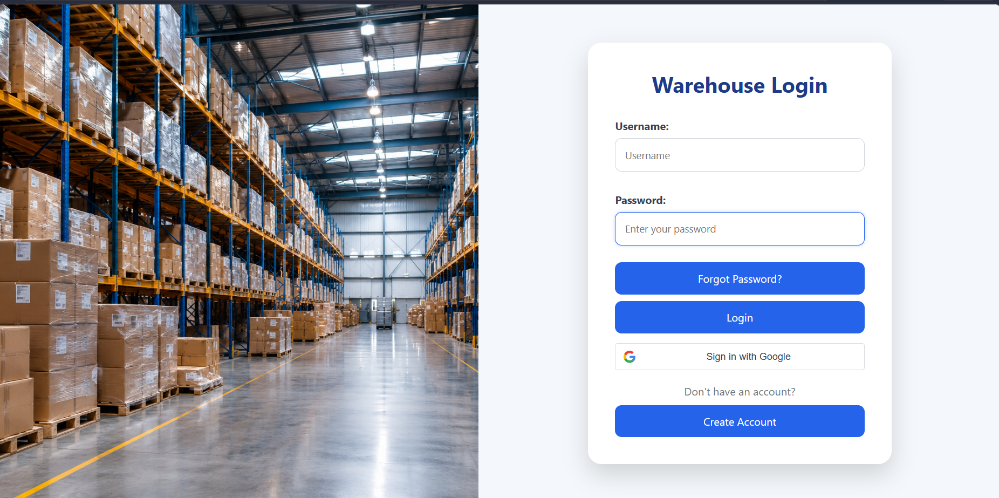
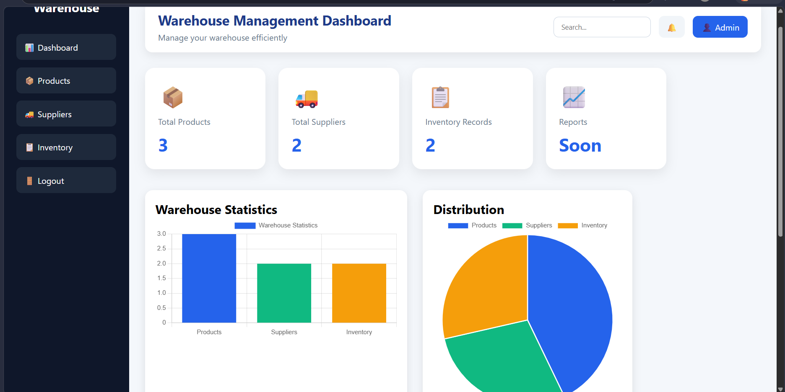
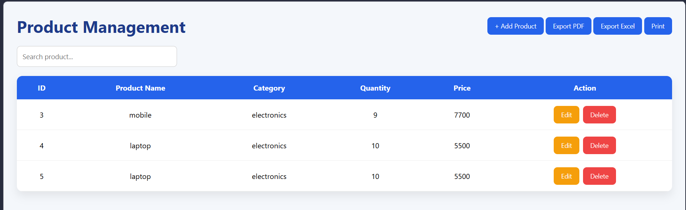
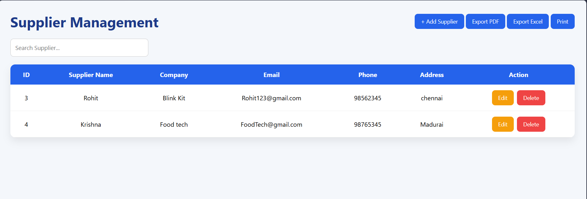
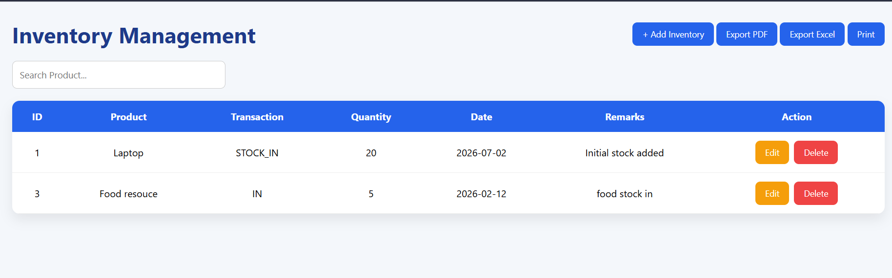

# 📦 Warehouse Management System

A Full Stack Warehouse Management System developed using **React JS**, **Spring Boot**, and **MySQL**. The application helps businesses manage products, suppliers, inventory, and user authentication through a modern web interface.

---

# 🚀 Features

## User Authentication
- User Login
- User Registration
- Forgot Password (OTP)
- Google Sign-In

## Dashboard
- Dashboard Statistics
- Low Stock Alerts
- Recent Products
- Recent Suppliers
- Charts & Reports

## Product Management
- Add Product
- Update Product
- Delete Product
- Search Products
- Export to PDF
- Export to Excel
- Print Products

## Supplier Management
- Add Supplier
- Update Supplier
- Delete Supplier
- Search Suppliers
- Export to PDF
- Export to Excel
- Print Suppliers

## Inventory Management
- Add Inventory
- Update Inventory
- Delete Inventory
- Search Inventory
- Export to PDF
- Export to Excel
- Print Inventory

---

# 🛠️ Technologies Used

## Frontend
- React JS
- HTML5
- CSS3
- JavaScript
- Axios
- React Router
- React Toastify

## Backend
- Spring Boot
- Java
- Spring Data JPA
- REST API
- Maven

## Database
- MySQL

## Tools
- Eclipse
- VS Code
- Git
- GitHub
- Postman

---

# 📂 Project Structure

```
warehouse-management-system
│
├── backend
│   ├── src
│   ├── pom.xml
│   └── mvnw
│
├── frontend
│   ├── public
│   ├── src
│   ├── package.json
│   └── package-lock.json
│
└── README.md
```

---

# ▶️ How to Run the Project

## Backend

```bash
cd backend
mvn spring-boot:run
```

## Frontend

```bash
cd frontend
npm install
npm start
```

---

# 📸 Project Screenshots

## Login Page



## Dashboard



## Products



## Suppliers



## Inventory


---

# 👨‍💻 Author

**Kamesh G**

- B.Tech – Information Technology
- Jaya Engineering College

---

# ⭐ GitHub Repository

If you like this project, please consider giving it a ⭐ on GitHub.
